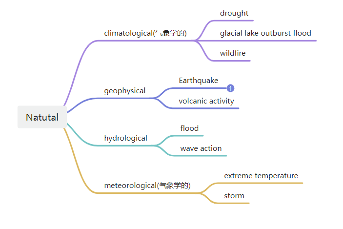

# final_project

## Data 

Data文件夹主要用于存放所有数据

主要包含数据如下，其中1900-2023.xlxs是所有年份的数据，而2000-2023.xlxs是2000-2023年的数据。

## Img

Img文件夹用于存图片，可以供展示等用途。

## Tableau

用于存储各自的tableau文件。

### 其他

tableau预测 [tableau帮助 | Tableau 中的预测工作原理 | 优阅达 (dkmeco.com)](https://www.dkmeco.com/community/help/tableau/desktop/52/936)

